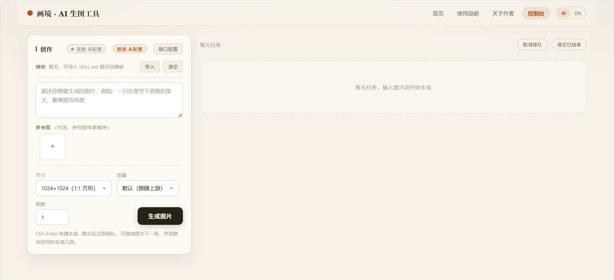
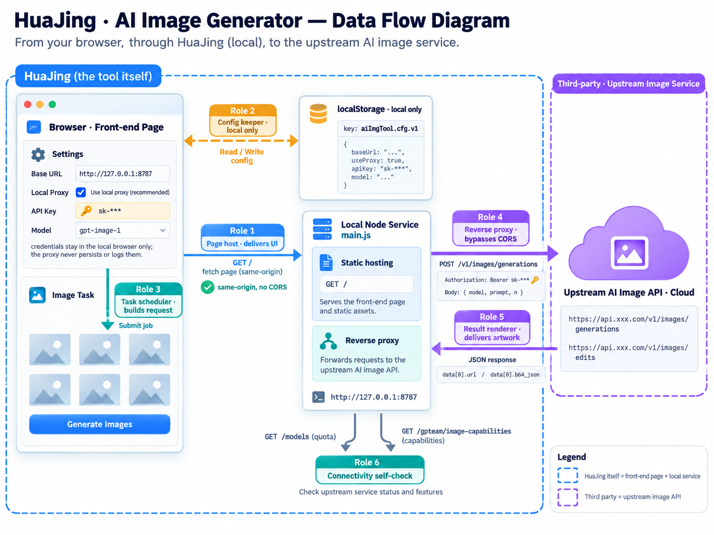

# 画境 · AI 生图工具

> 一语入画，万象成境。

一个纯前端、开箱即用的 AI 生图工作台：文生图、参考图生图、Skill 提示词模板、批量并发队列与额度查询，全部在浏览器里完成。兼容 OpenAI images 接口（默认对接 GPTEAM）。

[](LICENSE)
[](https://nodejs.org)
[](package.json)
[](CONTRIBUTING.md)




---

## 目录

- [中文文档](#中文文档)
- [English Documentation](#english-documentation)

---

## 中文文档

### 功能特性

- **文生图 / 图生图**：兼容 OpenAI images 接口；上传多张参考图自动走 multipart 图生图，序号即传参顺序，可自由调整先后
- **Skill 提示词模板**：导入 SKILL.md 一键套用模板，自动识别 BOM、GBK 等编码；仅在当前会话保留，刷新即清空
- **官方尺寸与质量档**：内置 GPTEAM 文档 12 种画幅的目标尺寸，自动联动 `aspect_ratio`；质量档 low / medium / high 可选
- **并发任务队列**：一次提交多张，按并发数自动调度；支持排队取消、失败重试、批量清理
- **额度与能力查询**：一键查询 API Key 剩余额度、订阅与额度包余量；可读取当前分组可用的图片模型能力
- **连通性自检**：页面加载自动检测接口连通性与额度，顶栏徽章实时展示
- **中英文切换**：头部「中 / EN」一键切换，选择持久化保存
- **隐私与本地化**：配置仅保存在本机浏览器 localStorage，不上传任何服务器

### 架构与数据流转

页面由本地服务同源托管，接口请求经本地反向代理转发至上游，API Key 只留在浏览器 localStorage。下图标注了画境在各步骤中扮演的角色：



### 快速开始

1. 前往 [GPTEAM 平台](https://portal.gpteamservices.com) 注册账号，在后台创建并复制你的 **API Key**（`sk-` 开头）
2. 在项目目录启动本地服务（零依赖，无需 `npm install`）：`npm start`，默认监听 `http://127.0.0.1:8787`
3. 浏览器打开 `http://127.0.0.1:8787`，页面与代理同源，不会被跨域拦截
4. 打开「控制台」→ 右上角「接口配置」，填入：
   - **Base URL**（默认已填 GPTEAM 地址）
   - **API Key**（第 1 步复制的 Key）
5. 输入提示词，点击「生成图片」（快捷键 `Ctrl + Enter`）

### 跨域（CORS）问题

**推荐：用本地服务打开页面**

```bash
npm start
```

浏览器访问 `http://127.0.0.1:8787`。本地服务（`main.js`）同时负责托管页面与转发接口请求，页面与代理同源，因此不会触发浏览器的跨域限制；「接口配置 → 本地代理」默认已填好 `http://127.0.0.1:8787`。

**直接双击打开 `ai-image-generator.html` 也能运行**，但接口请求可能被跨域策略拦截。此时先执行 `npm start`，再在「本地代理」填入 `http://127.0.0.1:8787` 即可。

换端口：`node main.js 9000`，并把「本地代理」同步改为 `http://127.0.0.1:9000`。

### 文件结构

```
├── ai-image-generator.html   # 主应用（单文件：HTML + CSS + 原生 JS）
├── main.js                   # 本地服务入口：托管页面 + 转发接口请求
├── package.json              # npm start 启动脚本与项目元信息
├── images/
│   ├── index.png             # 首页主图
│   ├── work.png              # 控制台界面截图（README 展示）
│   ├── architecture.png      # 数据流转图（README 展示）
│   ├── donate.png            # 微信赞赏码（README 展示）
│   └── SeekerLo.jpg          # 作者头像
├── skills/
│   └── style-prompt.md       # Skill 提示词模板示例（控制台「导入」可直接加载）
├── .github/
│   ├── workflows/ci.yml      # CI：语法检查 + 服务冒烟测试
│   ├── ISSUE_TEMPLATE/       # Issue 模板
│   └── pull_request_template.md
├── CONTRIBUTING.md           # 贡献指南
├── CODE_OF_CONDUCT.md        # 行为准则
├── LICENSE                   # MIT 许可证
└── README.md
```

### 技术说明

- 零框架、零构建：单文件 HTML；本地服务仅用 Node 内置模块，无第三方依赖
- 配置持久化：`localStorage` 保存接口配置与语言偏好
- 路由：hash 驱动的单页视图（首页 / 使用说明 / 关于作者 / 控制台）
- 计费说明：额度 = 周期窗口剩余 + 额度包剩余；实际扣费以 GPTEAM Portal 请求日志为准

### 作者

**SeekerLo** — 另一款产品：微信小程序「云拍立得」（微信搜"云拍立得"，制作电子拍立得）。

### 贡献与许可

- 参与贡献请先阅读 [CONTRIBUTING.md](CONTRIBUTING.md)
- 社区交流请遵守 [CODE_OF_CONDUCT.md](CODE_OF_CONDUCT.md)
- 本项目基于 [MIT License](LICENSE) 开源，Copyright (c) 2026 SeekerLo

### 请作者喝咖啡

如果画境帮到了你，欢迎请我喝一杯咖啡。你的支持是它持续维护下去的动力。


---

## English Documentation

> One line in, a world painted.

A pure front-end, zero-dependency AI image generation workbench: text-to-image, image-to-image with references, SKILL.md prompt templates, concurrent task queue, and quota inspection — all in your browser. Compatible with the OpenAI images API (GPTEAM by default).

### Features

- **Text-to-Image / Image-to-Image**: OpenAI images API compatible; uploading reference images automatically switches to multipart edits, with adjustable ordering
- **Skill Prompt Templates**: Import SKILL.md to apply prompt templates instantly; BOM/GBK encodings handled; session-only, cleared on refresh
- **Official Sizes & Quality Tiers**: 12 built-in aspect ratios from the GPTEAM docs with automatic `aspect_ratio` sync; quality tiers low / medium / high
- **Concurrent Task Queue**: Submit multiple images at once with automatic scheduling; cancel queued tasks, retry failures, batch cleanup
- **Quota & Capability Inspection**: One-click query of remaining API quota, subscription balance, and available image model capabilities
- **Connectivity Self-Check**: Automatic connectivity and quota check on page load, shown as header badges
- **Bilingual UI**: Switch between 中文 and English via the header toggle; preference persists
- **Privacy-First**: All configuration stays in your browser's localStorage — nothing is uploaded

### Architecture & Data Flow

The page is served same-origin by the local service, API requests are forwarded upstream through the local reverse proxy, and the API Key stays in the browser's localStorage. The diagram below shows the role HuaJing plays at each step:


### Quick Start

1. Sign up on the [GPTEAM portal](https://portal.gpteamservices.com), then create and copy your **API Key** (starts with `sk-`)
2. Start the local service in the project folder (zero dependencies, no `npm install` needed): `npm start`, listening on `http://127.0.0.1:8787` by default
3. Open `http://127.0.0.1:8787` in your browser — the page and the proxy are same-origin, so CORS never triggers
4. Go to **Console** → API Settings (top right), fill in:
   - **Base URL** (GPTEAM endpoint pre-filled)
   - **API Key** (the key copied in step 1)
5. Enter a prompt and hit **Generate** (shortcut: `Ctrl + Enter`)

### CORS Issues

**Recommended: open the page through the local service**

```bash
npm start
```

Then open `http://127.0.0.1:8787`. The local service (`main.js`) both serves the page and forwards API requests, so the page and the proxy are same-origin and the browser's CORS policy never applies; **Local Proxy** in the settings panel is pre-filled with `http://127.0.0.1:8787`.

**Opening `ai-image-generator.html` directly also works**, but API requests may be blocked by CORS. In that case run `npm start` first and set **Local Proxy** to `http://127.0.0.1:8787`.

To use another port: `node main.js 9000`, and update **Local Proxy** to `http://127.0.0.1:9000` accordingly.

### File Structure

```
├── ai-image-generator.html   # Main app (single file: HTML + CSS + vanilla JS)
├── main.js                   # Local service entry: serves the page + forwards API requests
├── package.json              # npm start script and project metadata
├── images/
│   ├── index.png             # Homepage hero image
│   ├── work.png              # Console screenshot (shown in the README)
│   ├── architecture.png      # Data flow diagram (shown in the README)
│   ├── donate.png            # WeChat reward QR code (shown in the README)
│   └── SeekerLo.jpg          # Author avatar
├── skills/
│   └── style-prompt.md       # Sample Skill prompt template (load it via "Import" in the Console)
├── .github/
│   ├── workflows/ci.yml      # CI: syntax checks + server smoke test
│   ├── ISSUE_TEMPLATE/       # Issue templates
│   └── pull_request_template.md
├── CONTRIBUTING.md           # Contribution guide
├── CODE_OF_CONDUCT.md        # Code of conduct
├── LICENSE                   # MIT license
└── README.md
```

### Technical Notes

- No frameworks, no build step: a single HTML file; the local service uses Node built-ins only, no third-party dependencies
- Persistence: API config and language preference stored in `localStorage`
- Routing: hash-driven single-page views (Home / Guide / About / Console)
- Billing: quota = periodic window remaining + quota package remaining; actual charges are per the GPTEAM Portal request logs

### Author

**SeekerLo** — also creator of the WeChat mini-program "云拍立得" (search "云拍立得" in WeChat to create electronic Polaroids).

### Contributing & License

- Read [CONTRIBUTING.md](CONTRIBUTING.md) before contributing
- Community interactions follow our [Code of Conduct](CODE_OF_CONDUCT.md)
- Released under the [MIT License](LICENSE), Copyright (c) 2026 SeekerLo

### Buy Me a Coffee

If HuaJing has been useful to you, you're welcome to buy me a coffee — your support keeps it maintained.


